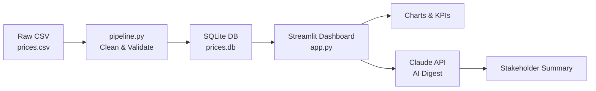

# 🇪🇬 Egypt Cost-of-Living Price Tracker

A personal data project tracking how prices of everyday items — groceries, transport, and utilities — have changed across Egyptian cities since January 2024.

Egypt has experienced significant inflation over the past two years. This project applies a simple data engineering pipeline to make those changes visible and measurable.

---

## What It Does

- **Cleans and validates** raw price data (null checks, outlier detection, type enforcement)
- **Stores** cleaned data in a local SQLite database with SQL aggregation queries
- **Visualises** trends in an interactive Streamlit dashboard (price over time, category breakdowns, city comparisons, biggest movers)
- **Generates AI summaries** using the Claude API — a plain-English stakeholder digest of recent price movements

---

## Process Flow



---

## Project Structure

```
egypt-price-tracker/
├── data/
│   ├── prices.csv          # Raw price data (manually collected)
│   └── prices.db           # SQLite database (generated by pipeline)
├── scripts/
│   └── pipeline.py         # Data cleaning, validation, SQL storage
├── dashboard/
│   └── app.py              # Streamlit dashboard + AI digest
├── requirements.txt
└── README.md
```

---

## Quickstart

```bash
# 1. Install dependencies
pip install -r requirements.txt

# 2. Run the data pipeline (cleans CSV → builds SQLite DB)
python scripts/pipeline.py

# 3. Launch the dashboard
ANTHROPIC_API_KEY=your_key_here streamlit run dashboard/app.py
```

> The dashboard works without an API key — the AI digest button is disabled if no key is set.

---

## Sample SQL Queries

```sql
-- Average price per category
SELECT category, ROUND(AVG(price_egp), 2) AS avg_price
FROM prices
GROUP BY category
ORDER BY avg_price DESC;

-- Month-on-month change for a specific item
SELECT strftime('%Y-%m', date) AS month, price_egp
FROM prices
WHERE item = 'Chicken (1kg)' AND city = 'Cairo'
ORDER BY date;

-- Cairo vs Alexandria grocery comparison
SELECT city, ROUND(AVG(price_egp), 2) AS avg_grocery_price
FROM prices
WHERE category = 'Groceries'
GROUP BY city;
```

---

## Tech Stack

| Layer | Tool |
|---|---|
| Data cleaning & analysis | Python, pandas, numpy |
| Storage & querying | SQLite (SQL — joins, aggregations, views) |
| Visualisation | Streamlit, Plotly |
| AI digest | Claude API (Anthropic) |
| Version control | Git / GitHub |

---

## Limitations

- Price data is manually collected — not scraped in real time. Figures are representative estimates based on publicly available market data, not official statistics.
- City coverage is limited to Cairo and Alexandria; expansion to Mansoura, Assiut, and others is a planned next step.
- The AI digest summarises trends but does not perform causal analysis.

---

## Author

**Amr Elhamady** · Electrical & Electronics Engineering · Coventry University, Egypt  
[LinkedIn](https://linkedin.com/in/amr-elhamady) · [GitHub](https://github.com/amrfr)
